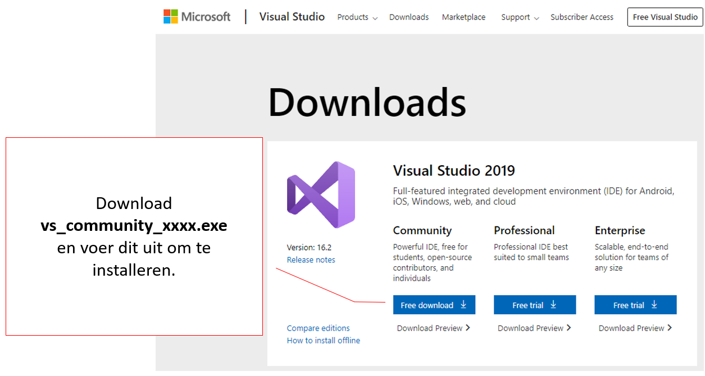
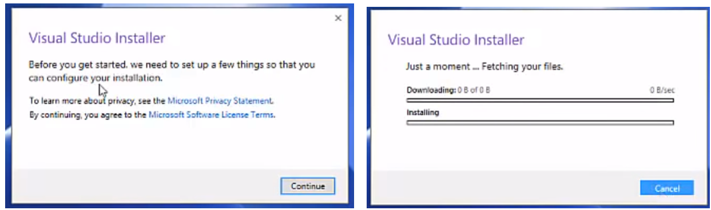
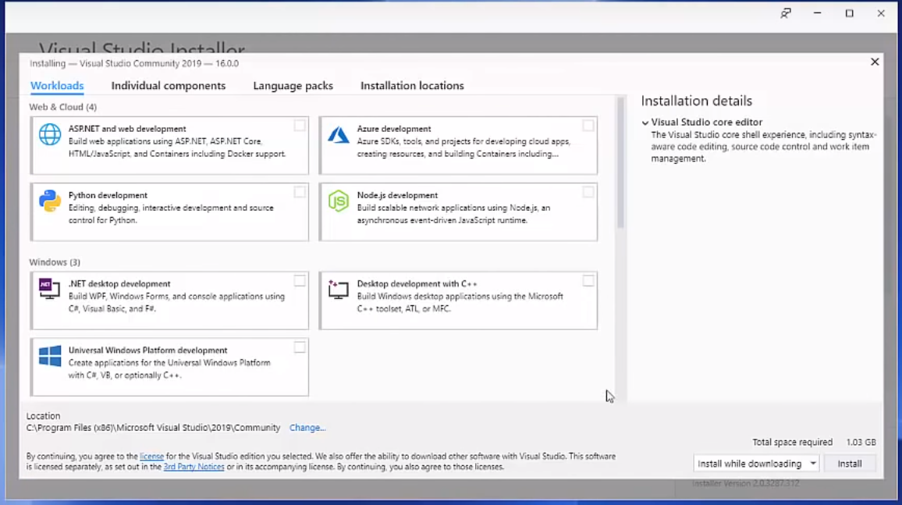
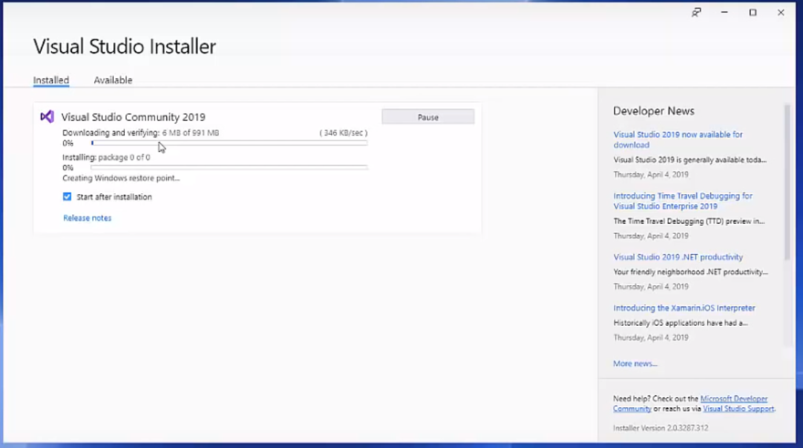
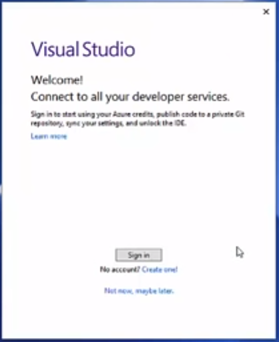
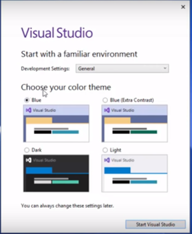
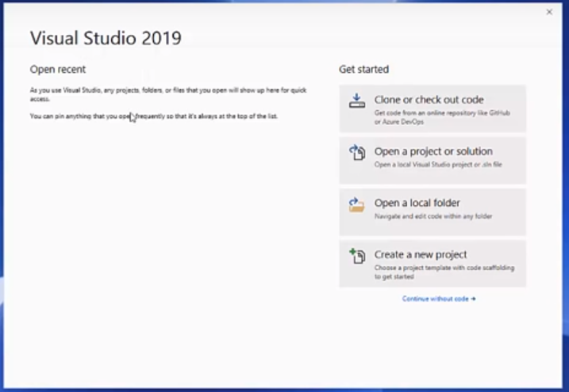

# Installatie van Visual Studio 2019

Om de basis van programmeren aan te leren gebruiken we **Visual Studio Community 2019**.

1. Downloaden van de installatiesoftware: 
https://visualstudio.microsoft.com/downloads/

2. Bij het uitvoeren van de installatiesoftware worden eerst nog wat files gedownload...

3. Vervolgens selecteer je ENKEL **.NET desktop development** om te installeren.

4. De installatiesnelheid zal hoofdzakelijk van de snelheid van je laptop en internetverbinding afhankelijk zijn.

5. Het is mogelijk dat je na de installatie je laptop moet heropstarten.
6. Je start Visual Studio 2019 op via de snelkoppeling op jouw bureaublad.

7. Bij de eerste opstart moet je inloggen met een account, gebruik hiervoor jouw VIVES email.

8. Nadien kan je nog jouw voorkeur voor een kleur thema instellen.

9. Als alles goed zit zou je onderstaand venster moeten zien en ben je klaar om te programmeren.

