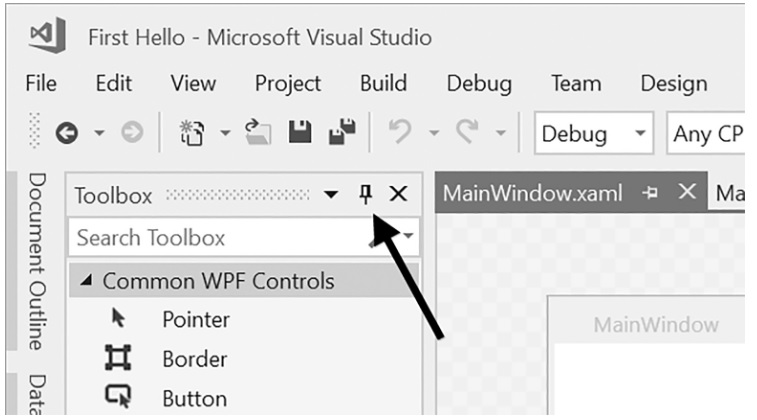
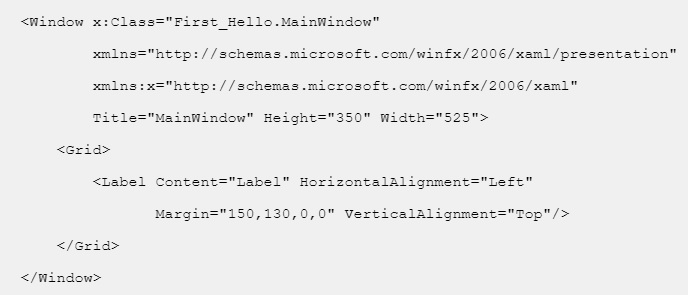
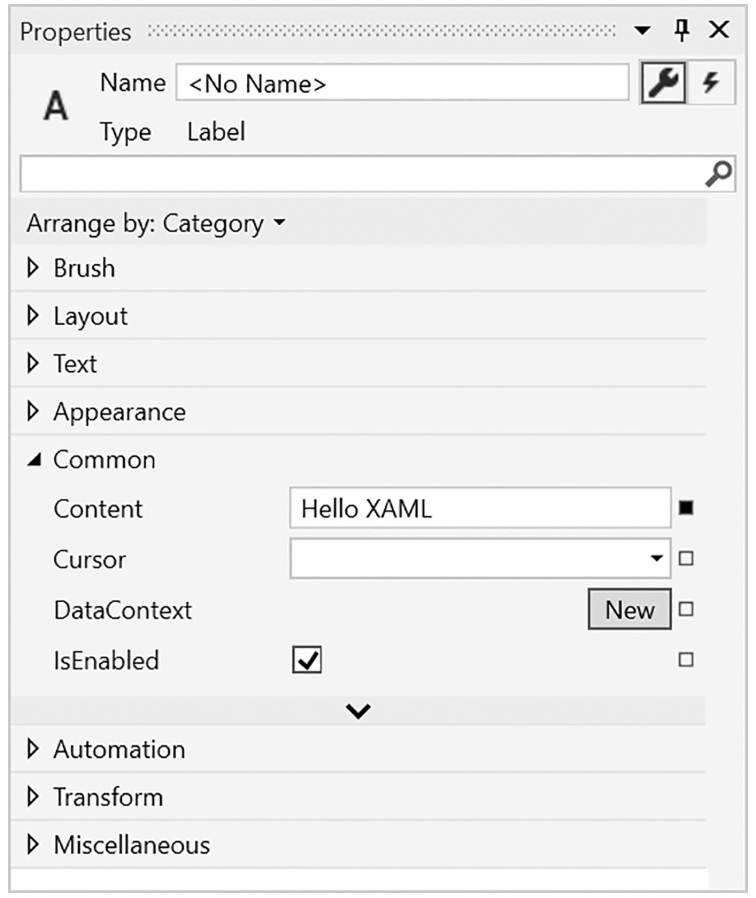
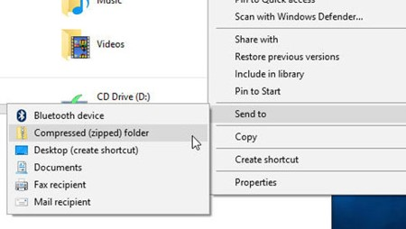

# Introductie tot programmeren

## Wat is programmeren ?

Een computerprogramma is **een opeenvolging van instructies** met als doel om **een specifieke taak met een computer uit te voeren**.

In zijn eenvoudigste vorm kan je dit vergelijken met bv 
* Een recept
* Een muziekpartituur
* Een breipatroon
* Een gebruiksaanwijzing
* De montage instructies van Ikea

Als voorbeeld nemen we een fles shampoo, het ‘programma’ zou dan kunnen zijn :

1. Maak het haar nat
2. Doe er de shampoo op
3. Wrijf de shampoo door het haar
4. Spoel de shampoo uit je haar
5. Droog je haar af

:::warning Nota:
Een programma is dus een logische opeenvolging van handelingen/instructies die er voor zorgen dat een taak volbracht kan worden.
:::

:::tip Oefening 1.1
Ga in 5 groepjes zitten en schrijf de instructies neer om: 
* Een biefstuk te bakken
* Een pint te tappen
* Te tanken
* Een straat over te steken op het voetpad
* Een mail te versturen
:::

Om er voor te zorgen dat de computer onze instructies begrijpt moeten we een taal gebruiken die wij kunnen lezen/programmeren en die de computer kan verstaan.

Zo’n taal noemen we een **programmeertaal**. 

* Java
* Python
* C / C++ / C#
* …

In deze cursus zullen we **C#** (c sharp) gaan gebruiken.

## Op verkenning door onze laptop
Laten we **Windows Verkenner** even opstarten.
* Wat staat er allemaal op onze C-schijf (OS-drive).
* Sommigen hebben een D-schijf (Data-drive).
* Waar staat onze software en waar schrijven we onze DATA weg?

:::warning ‘Good Practice’
* Maak een folder waar je alles van school in plaatst
(vb School of Vives of Graduaat IoT of …)
* Maak een folder waar je alles van dit vak plaatst
(vb Basis programmeren)
* Voor elk project (oefening, voorbeeld, programma,… ) zal ook een een folder aangemaakt worden.
:::

De belangrijkste files in je projectfolder zijn:
* Een Xaml-file ( daarin staat de opmaak van de user interface van je project )
* Een cs-file ( daarin staat de sourcecode van je project )

:::warning Indienen files
Om een oefening of project in te dienen moet je die folder comprimeren naar een ZIP-file en die file via Toledo indienen. 

**Let op:** Een ZIP-file kan je niet doormailen binnen VIVES, daarvoor gebruik je dan WinRAR. 
:::

## Een eerste programma maken en uploaden

Laten we klassikaal even de programeeromgeving van *Visual studio* ontdekken:
* Een nieuw project starten **WPF App (.NET Framework)** met de naam "Voorbeeld 1.1".
* De Xaml-file en cs-file bekijken.
* In de Xaml-file plaats je steeds **de titel op een zinvolle omschrijving** voor het programma, je zorgt er ook steeds voor de de height en width van jou venster net groot genoeg is om alle objecten te bevatten maar niet groter.
* In de Xaml-file Een object (vb label) toevoegen aan onze form via toolbox.

* Een tweede object toevoegen via de code, in te tikken in de Xaml-file.

* Wat experimenteren met de eigenschappen van het object ( tekst, achtergrond, … ).

:::warning Naamgeving van objecten:
Afkorting van het object in kleine letters gevolg door de naam.
(vb: label = lblVoornaam , button = btnVerzend , … )
:::

Nu dien je het gemaakte voorbeeld bij wijze van test in via Toledo:
* Ga in Windows verkenner naar de folder van je project.
* Comprimeer de folder naar een ZIP-file.

* Indienen via Toledo in het menu Toetsing.

## Een event koppelen aan een object

Laten we een tweede voorbeeldprogramma ( naam = Oefening 1.2) aanmaken.
* Plaats een label en een button op jouw user interface ( XAML). Alle objecten die je op de user interface plaatst waarmee je interactie moet hebben vanuit de code moeten een naam krijgen. **Zorg dat dit eerst in orde is voor je naar je code overgaat.**
* Dubbelklik op de button om de "event container" te creëren.
* Pas de content van je label aan in de event container.

:::tip Taak 1

**Oefening 1.3**

 Maak een user interface met 3 knoppen met de tekst er van respectievelijk Ja, Nee en Reset. Plaats ook 3 labels op de user interface met de content ervan op respectievelijk A,B en C.
 Zorg er nu voor dat:
 * Bij het aanklikken van button "Ja" alle labels de content "Ja" krijgen.
 * Bij het aanklikken van button "Nee" alle labels de content "Nee" krijgen.
 * Bij het aanklikken van button "Reset" alle labels terug hun originele content A,B en C krijgen.
:::

