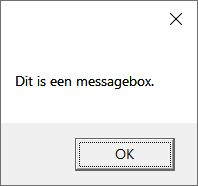
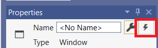
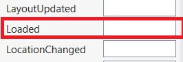
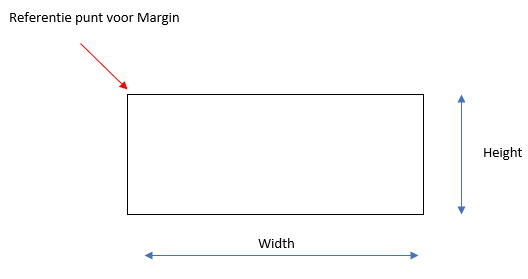
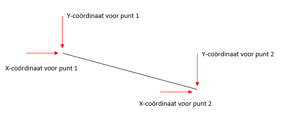
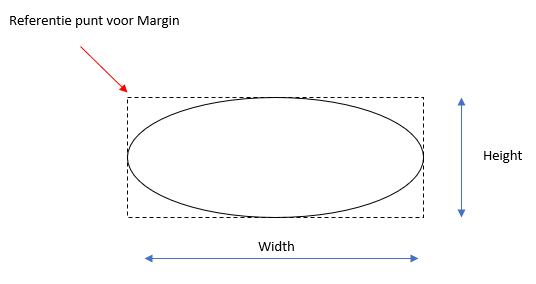

# Objecten en events

## De messagebox

Een **messagebox** is een venster die verschijnt met een melding en een OK-button. Het is bedoeld om een bericht te melden aan de gebruiker van het programma, meestal omdat er iets fout is.



Laten we dit even uitproberen in een voorbeeldprogramma ( naam = **Oefening 2.1**).
* Plaats een button op jouw user interface ( XAML).
* Dubbelklik op de button om de "event container" te creëren.
* Roep de messagebox als volgt op:

 ```csharp
 {
    MessageBox.Show("Je hebt op de button geklikt!");
 }
 ```

:::tip Enkele oefeningen:

**2.2** Schrijf een programma met 1 label "Message" en 2 knoppen "ON" en "OFF" in de user interface.
Klik je op de "ON" knop wordt het label zichtbaar, klik je op de "OFF" knop dan wordt het label onzichtbaar.

**Tip**: Maak gebruik van de eigenschap Visibility.Visible (zichtbaar) , Visibility.Collapsed (onzichtbaar).

lblMessage.Visibility = Visibility.Collapsed;

**2.3** Schrijf een programma dat bij het starten van het programma een eerste messagebox toont met je voornaam en naam en daarna een tweede messagebox toont met jouw leeftijd.

**Tip** : Maak gebruik van het *Loaded* event van het venster.

Klik hiervoor op het bliksempje als je het venster hebt geselecteerd en zoek het Loaded event.



Dubbelklik er vervolgens op om de event methode aan te maken in de sourcecode.



**2.4** Het event *MouseEnter* treedt op wanneer de cursor over een object wordt bewogen. Schrijf nu een programma dat een Messagebox laat zien met de tekst "Over Button" zodra je de muis boven een knop houdt.
:::

## De grafische interface

In ons programma kunnen we allerhande grafische vormen tekenen. Meestal om bepaalde zaken duidelijk te maken aan de gebruiker of om bv een grafiek te tonen van sensordata.

Net zoals wij dit doen gebruiken we in de software hiervoor een papier wat in C# de **canvas** noemt.

### Canvas

Je kan een canvas aan jouw user interface toevoegen door het object via de toolbaar toe te voegen en dan de eigenschappen correct te zetten. Die-hard codeurs zullen dit in de XAML file rechtstreeks intikken. Je geeft best een achtergrondkleur aan jou canvas zodat je duidelijk kan zien waar die zich bevindt.

```yaml
<canvas Name="paperCanvas" Height="200" Width="150" Margin="105,27,0,0," VerticalAlignment="Top" HorizontalAlignment="Left" Background="LightGray"/>
```
Op je canvas kan je nu allerhande grafische zaken gaan toevoegen zoals een rechthoek, een lijn, een ellips of een afbeelding.

### Rechthoek

Je kan een rechthoek bv gebruiken om een balkgrafiek weer te geven.

#### Via sourcecode

Via een event kan je een rechthoek toevoegen aan je canvas vanuit de sourcecode.

```csharp
Rectangle balk = new Rectangle();
balk.Width = 100;
balk.Height = 50;
balk.Margin = new Thickness(10,10,0,0);
balk.Stroke = new SolidColorBrush(Colors.Black);
paperCanvas.Children.Add(balk);
```


We maken in de eerste coderegel een nieuwe instantie aan van het type Rectangle. Daarna vullen we de eigenschappen Width, Height, Margin en Stroke (omtrek) in. Als laatste voegen we onze rechthoek als een kind toe aan de canvas.

#### Via Xaml

We kunnen er ook voor zorgen dat de rechthoek reeds onmiddellijk samen met de canvas aangemaakt wordt via de XAML.

```yaml
<Canvas ...>
    <Rectangle Name="balk" Width="100" Height="50" Margin="10,10,0,0" Stroke="Black" Visiblity="Hidden"/>
</Canvas>
```
Door `Visility="Hidden"` te gebruiken zie je bij de start van het programma de rechthoek niet en kan je in de code op het gepaste ogenblik dit zichtbaar zetten.

### Lijn

Je kan een lijn voor allerhande grafische toepassingen gebruiken zoals bv een lijngrafiek.
Om een lijn via code toe te voegen ga je als volgt te werk:

```csharp
Line lijn = new Line();
lijn.X1=10; lijn.Y1=10;
lijn.X2=110; lijn.Y2=60;
lijn.Stroke = new SolidColorBrush(Colors.Black);
paperCanvas.Children.Add(lijn);
```



### Ellips

Je kan een ellips voor allerhande grafische toepassingen gebruiken zoals bv een taartgrafiek.
Om een ellips via code toe te voegen ga je als volgt te werk:

```csharp
Ellipse cirkel = new Ellipse();
cirkel.Width = 100;
cirkel.Height = 100;
cirkel.Margin = new Thickness(10,10,0,0);
cirkel.Stroke = new SolidColorBrush(Colors.Black);
paperCanvas.Children.Add(cirkel);
```

Als je de breedte en hoogte van een elipse gelijk maakt krijg je een cirkel.



### Afbeelding

Je kan ook afbeeldingen toevoegen aan jouw canvas. Je gaat hiervoor als volgt te werk:

```csharp
BitmapImage afbSource = new BitmapImage();
afbSource.BeginInit();
afbSource.UriSource = new Uri(@"pathtofile\filename.jpg"), UriKind.RelativeOrAbsolute);
afbSource.EndInit();
Image afbeelding = new Image();
afbeelding.Source = afbSource;
afbeelding.Margin = new Thickness(120,10,0,0);
afbeelding.Width = 150;
afbeelding.Height = 150;
paperCanvas.Children.Add(afbeelding);
```

## Commentaar toevoegen in de code

Terwijl je volop aan het coderen bent komt elke regel code logisch en duidelijk over. Maar voor iemand anders of als je de code maanden later opnieuw bekijkt is dit niet zo.
Daarom is het belangrijk commentaar bij jou code te voorzien.

```csharp
// Dit is commentaar op 1 lijn 

afbeelding.Width = 150; // Dit is commentaar na een lijncode

/* Dit is commentaar
   die over verschillende
   lijnen loopt */
```
Met de laatste methode kan je ook tijdelijk stukken code uitschakelen.

::: tip Taak 2 - Programmeren met de grafische interface


* [Opdrachtfiche](assignment.html)
:::

