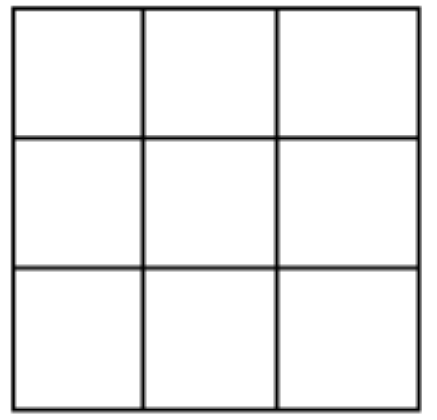
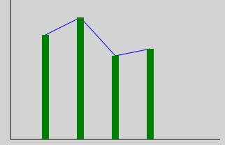

# Taak 2 - Programmeren met de grafische interface

## Opdrachten

**1.** Schrijf een programma met een knop "DRAW" en een canvas van 400x400. Als men op de Draw-knop drukt wordt een rechthoekige driehoek weergegeven op het canvas. Zorg er voor dat je driehoek op 25 pixels van de linker- en onderzijde van het canvas zijn hoek van 90 graden heeft.

**2.** Schrijf een programma met een knop "SHOW" en een canvas van 400x400. Als men op de Show-knop drukt wordt een leeg boter-kaas-en-eierenbord getoond. De buitenzijde is met een rechthoek getekend en de rest met lijnen. Dit is in de XAML voorzien en wordt enkel visueel geplaatst vanuit de code.

**3.** Dit zijn de gegevens van de jaarlijkse regenval an het fictieve land Tatooine.

2009: 150cm, 2010: 175cm, 2011: 120cm, 2012: 130cm, 2013:180cm, 2014: 115cm

Schrijf een programma met een knop "GRAPH" en een canvas van 200x200. Als men op de Graph-knop drukt worden de gegeven in een lijn en balk grafiek weergegeven. Zorg voor aslijnen in een zwarte kleur. De lijngrafiek krijgt een blauwe kleur en de balkgrafiek een groene kleur.
 
    

## Tips

* Overloop de leerstof van objecten en events nog even voor je hieraan begint.
* Verzorg je naamgeving van objecten.
* Lees de opdrachten goed en werk met een checklist wat vink af wat klaar is.

## Evaluatie

Deze opdracht staat op **10%** van de totale score voor basic programming 1.

De evaluatie gebeurt op basis van:
* Is jou code geschreven de good practices van programmeren?
* Het product: Doet het programma wat er gevraagd is?
* Het proces: Hoe is het programma geschreven?
