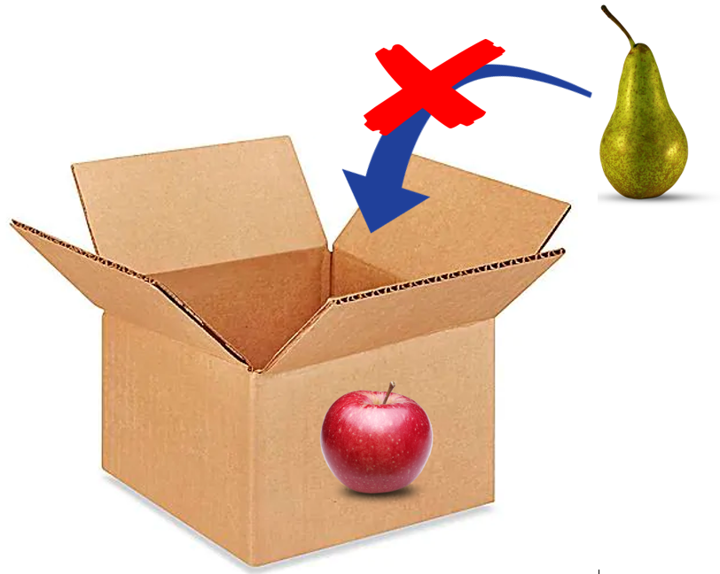
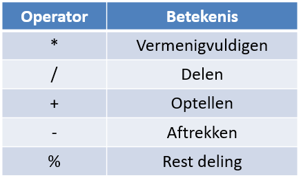
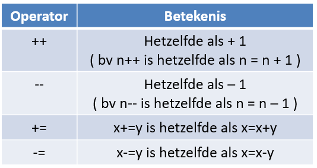
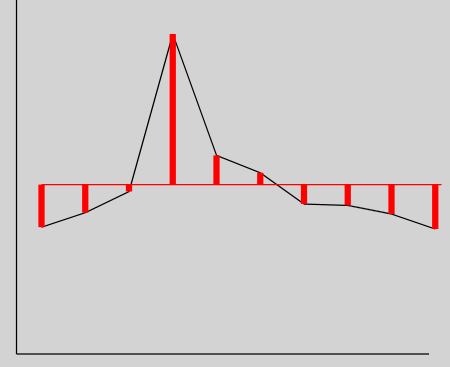
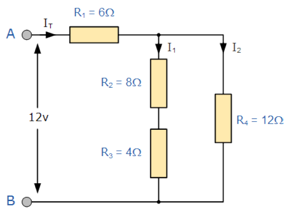

# Variabelen en berekeningen

## Variabelen

Een variabele is een container of doos waarin je informatie kan bewaren.

De meest gebruikte variabele types zijn:
* **string**: wordt gebruikt om tekst in te bewaren
* **int**: wordt gebruikt om gehele getallen in te bewaren
* **double** wordt gebruikt om kommagetallen in te bewaren

Het definiëren van een variabele gebeurt als volgt:
```csharp
int lengte, breedte;
double prijs;
string voornaam;
```
:::warning Nota:
De naam van een variabele start je steeds met een kleine letter en kan geen spaties bevatten.
:::

Bij het toekennen van een waarde aan een variabele heb je een linkerdeel (de target of variabele) en een rechterdeel (de waarde). 

:::warning Nota:
Onthou dat de waarde steeds van hetzelfde datatype moet zijn als de variabele.
:::



Je kunt geen peren in een bak voor appelen steken.

Het toekennen van een waarde gebeurt als volgt:
```csharp
int lengte;
lengte = 100;
```
of
```csharp
int lengte = 100;
```
## Berekeningen

We onderscheiden volgende rekenkundige operatoren:



Aangevuld met volgende speciale operatoren:



Een berekening kan er b.v. als volgt uit zien:
```csharp
int lengte = 100;
int breedte = 250;
int opp = lengte * breedte;
```
:::warning Nota:
Eerst wordt dus het rechterdeel berekend, dit is van een bepaald datatype, vervolgens wordt dit toegekend aan de target variabele.
:::

Laten we even enkele voorbeelden bekijken:
```charp
int i;
i = 6 * 2;      Het resultaat is 12
i = 3 / 2;      Het resultaat is 1
i = 33 / 44;    Het resultaat is 0

double i;
i = 10.6 / 2;   Het resultaat is 5.3
i = 3 / 2;      Het resultaat is 1 
```
:::warning Nota:
De software rekent met de eenvoudigste vorm van datatype. Als je dus 5 gebruikt in een berekening is dit een integer terwijl 5.0 een double zal zijn.
:::

:::tip Oefening

**3.1** Schrijf een programma waar de gebruiker het aantal stuks, de eenheidsprijs (2 cijfers na de komma) en de btw % kan ingeven.
Na het indrukken van de CALC-knop verschijnt de totaalprijs in een label.

Controle:

aantal = 4 stuks , eenheidsprijs = 99.95€ , btw = 21%

brutoprijs = (99.95 * 4)*(100 + 21)/100 = 483.758€

Tip:
Om de ingevulde waarde van string naar int om te zetten ga je als volgt te werk: 
```csharp
int aantal = Convert.ToInt32(txbLengte.Text);
```
Om het resultaat van int terug naar string om te zetten ga je als volgt te werk: 
```csharp
lblBrutoprijs.Content = Convert.ToString(brutoprijs);
```
:::

:::tip Taak 3

**3.2** Schrijf een programma waar je de lengte, hoogte en breedte van een balk kunt ingeven. Als men vervolgens op de CALC-knop drukt wordt het volume van de balk berekend en weergegeven in een label.

**3.3** Schrijf een programma om de omtrek, oppervlakte en het volume van een cirkel en een bol te berekenen.

1. zorg dat de gebruiker de straal kan inbrengen ( kommagetal )
2. zorg dat de 3 resultaten duidelijk op het scherm komen 
3. Formules:
```csharp
omtrek = 2 * Math.PI * straal;
opp = Math.PI * Math.Pow(straal,2);
volume = ( 4 * Math.PI / 3 ) * Math.Pow(straal,3);
```   

**3.4** Twee studenten nemen deel aan het C#-examen. Hun resultaten ( een geheel getal tussen 0 en 100 ) worden toegekend aan twee variabelen.

```csharp
int resultaatStudent1 = 44;
int resultaatStudent2 = 51;
```

Schrijf een programma dat het gemiddelde cijfer berekent als een double-waarde en dit cijfer op het scherm laat zien.

Controleer je antwoord met een rekenmachine en schrijf in een commentaarlijntje jou bevindingen in het programma.

**3.5** Uitbreidingsoefening

*Deze oefening is enkel voor die studenten die een extra uitdaging wensen aan te gaan*.

Een temperatuursensor meet elke 10 min de temperatuur in een buis. De metingen in °C zijn :
 - 10,15           
 - 11,31
 - 13
 - 25,6
 - 15,89
 - 14,5
 - 12
 - 11,89
 - 11,2
 - 10

 Schrijf een programma dat:
 
1. De meetwaarden uitzet in een lijngrafiek voorzien van aslijnen
2. Het gemiddelde bepaald van de meetwaarden en dit als een horizontale lijn weergeeft op de grafiek
3. Balkgrafiekjes plaatst vanaf dat gemiddelde naar elke meetwaarde



4. De gemiddelde waarde wordt ook in een label visueel gemaakt.
5. Plaats eventueel labels bij je aslijnen.
:::

## Operaties met een string

Net zoals bij getallen kan je ook strings met elkaar optellen.

```csharp
string voornaam = "Jan";
string familienaam, naam, titel;
familienaam = "Jansens";
naam = voornaam + " " + familienaam;
titel = "Dhr. "+naam+" studeert de opleiding Graduaat Internet of Things";
```

Indien je een lege string wil definiëren kan dit als volgt:
```csharp
string titel = "";
of
string titel = String.Empty;
of 
string titel = null;
```
Laten we even kijken wat er gebeurt als we volgende code schrijven:
```csharp
int appels = 2, peren = 3;
string resultaat, zin = "Het antwoord is: ";
resultaat = intro + appels + peren;
```
Er zijn twee mogelijkheden:
* **Het antwoord is: 23**   Dit omdat de twee + operatoren op de string worden uitgevoerd
* **Het antwoord is: 5**    Dit omdat eerst de cijfers worden opgeteld

De eerste mogelijkheid is de juiste omdat C# van links naar rechts de evaluatie uitvoert. De eerste + zet de waarde van appels om in een string en voegt deze samen met de string van intro, vervolgens doet de tweede + dit nog eens.

Wil je echter het tweede resultaat dan moet je haakjes gebruiken:
```csharp
resultaat = intro + (appels + peren);
```
## Conversie van datatypes

Op de schrijfwerkwijze zoals hierboven doe je beroep op C# om de conversie van integer naar string voor jou te doen. Dat is geen 'best-practice' techniek. Je zorgt steeds dat je zelf deze omzetting in de juiste code voorziet:

* Om iets om te zetten naar string gebruik je `Convert.ToString()`
* Om iets om te zetten naar integer gebruik je `Convert.ToInt32()`
* Om iets om te zetten naar double gebruik je `Convert.ToDouble()`

Een andere methode gaat als volgt:
```csharp{4,5}
int i = 33;
double d = 3.9;
double d1;
d1 = (double)i;     // d1 wordt 33.0
i = (int)d;         // i  wordt 3
```
## Geformateerde strings

Via geformateerde strings kan je tekst, getallen en weergave combineren. Je herkent stringformattering onmiddellijk aan het **$-teken** voor de string en de `{}` waar een getal geformatteerd wordt weergegeven.

```csharp
lblResultaat.Content = $"{euro} euro en {cent} cent";
lblPrijs.Content = $"De kostprijs is {prijs:c}";
```

Extra info kan je [hier](/files/stringformat.pdf) terugvinden.

## De rol van expressies

Expressies of berekeningen kan je ook gebruiken om structuur en eenvoud in je code te brengen. Stel b.v. dat je een lijn op de canvas moet plaatsen die t.o.v. de linkeronderzijde van je canvas moet gepositioneerd zijn. 

Je code zou er dan als volgt kunnen uitzien:
```csharp
int x0 = 10;     // referentiepositie in de x richting t.o.v. de canvas
int y0 = 390;    // referentiepositie in de y richting t.o.v. de canvas

Line xAs = new Line();
xAs.X1 = x0; xAs.Y1 = y0;
xAs.X2 = x0; xAs.Y2 = y0 - 380;
```

:::tip Taak 4

**3.6** Schrijf een programma waarin de gebruiker de temperatuur in graden Farenheit kan invullen. Door het drukken op de Convert-knop wordt het equivalent in graden Celcius in een label getoond. De temperatuur wordt ingebracht en weergegeven tot 2 cijfers na de komma.
 
```csharp
celcius = ( fahrenheit - 32 ) * 5 / 9;
```
 
**3.7** We krijgen een aantal seconden aangeleverd:
```csharp
int aantalSeconden = 2549;
```
Schrijf een programma dat dit aantal omrekent naar uren, minuten en seconden en laat dit vervolgens in een label zien. Werk eerst het voorbeeld op papier uit voor je gaat programmeren.

U:0 M:42 S:29

**3.8** Schrijf een programma waar de gebruiker de waarde van 2 weerstanden kan inbrengen (2 cijfers na de komma).

Bereken vervolgens de serie- en parrallelweerstand voor die twee:
```csharp
double rSerie = r1 + r2;
double rParallel = ( r1 * r2 ) / ( r1 + r2 );
```
Toon het resultaat in twee labels.

**3.9** Uitbreidingsoefening

*Deze oefening is enkel voor die studenten die een extra uitdaging wensen aan te gaan*.

Een elektrische schakeling bestaat uit volgende weerstanden:



Schrijf een programma dat:
 * De waarde van R1...R4 vraagt via textboxen
 * De waarde van de weerstanden bewaart in integer variabelen
 * De waarde van de bronspanning U vraagt in een textbox
 * De waarde van de bronspanning bewaart in een double variabele
 * De serieweerstand R23 berekent en bewaart in een integer variabele
```csharp
 int r23 = r2 + r3;
```
* De parallelweerstand R234 berekent en bewaart in een double variabele

```csharp
 double r234 = ( r23 * r4 ) / ( r23 + r4 );
```  
* De serieweerstand R1234 berekent en bewaart in een double variabele
```csharp
int r1234 = r1 + r234;
```
* De stroom door de weerstand R1234 berekent en bewaart in een double variabele
```csharp
double it= u / r1234;
```  
* Het resultaat van R23 weergeeft in een label zonder gebruik te maken van string formattering.
* Het restultaat van R234 weergeeft in een label, tot op 2 cijfers na de komma, via string formattering.
* Het resultaat van R1234 weergeeft in een label, rond dit getal af tot op 2 cijfers na de komma. Gebruik hiervoor de functie `Round(double,int)` waarbij `double` het getal is en `int` het aantal cijfers na de komma.
* Het resultaat van de stroom door de weerstand R1234 in een label uitgedrukt in mA zonder cijfers na de komma.
 
Controle: R23 = 12Ω , R234 = 6Ω , R1234 = 12Ω en It = 1000 mA

Probeer het ook eens met andere getallen.

Wat gebeurt er als je tekst ingeeft i.p.v. een getal?
:::