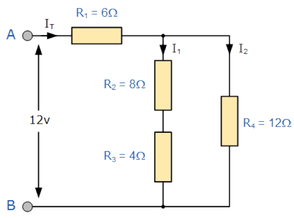

# Taak 3 - Programmeren met variabelen en bewerkingen


## Opdrachten

Bij deze taak mag je kiezen, je maakt ofwel oefeningen 1 t.e.m. 5 of je maakt de uitdagingsoefeningen 6 en 7.

**1.** Schrijf een programma waar je de lengte, hoogte en breedte van een balk kunt ingeven. Als men vervolgens op de CALC-knop drukt wordt het volume van de balk berekend en weergegeven in een label.

**2.** Schrijf een programma om de omtrek, oppervlakte en het volume van een cirkel en een bol te berekenen.

1. zorg dat de gebruiker de straal kan inbrengen ( kommagetal )
2. zorg dat de 3 resultaten duidelijk op het scherm komen 
3. Formules:
```csharp
omtrek = 2 * Math.PI * straal;
opp = Math.PI * Math.Pow(straal,2);
volume = ( 4 * Math.PI / 3 ) * Math.Pow(straal,3);
```   

**3.** Schrijf een programma waarin de gebruiker de temperatuur in graden Farenheit kan invullen. Door het drukken op de Convert-knop wordt het equivalent in graden Celcius in een label getoond. De temperatuur wordt ingebracht en weergegeven tot 2 cijfers na de komma.
 
```csharp
celcius = ( fahrenheit - 32 ) * 5 / 9;
```
 
**4.** Schrijf een programma dat het ingebracht aantal seconden omrekent naar uren, minuten en seconden en laat dit vervolgens in een label zien. Werk eerst het voorbeeld op papier uit voor je gaat programmeren.

Controle: 5549 seconden = 01:32:29

**5.** Schrijf een programma waar de gebruiker de waarde van 2 weerstanden kan inbrengen (2 cijfers na de komma).

Bereken vervolgens de serie- en parrallelweerstand voor die twee:
```csharp
double rSerie = r1 + r2;
double rParallel = ( r1 * r2 ) / ( r1 + r2 );
```
Toon het resultaat in twee labels.

**6.** Een elektrische schakeling bestaat uit volgende weerstanden:



Schrijf een programma dat:
 * De waarde van R1...R4 vraagt via textboxen
 * De waarde van de weerstanden bewaart in integer variabelen
 * De waarde van de bronspanning U vraagt in een textbox
 * De waarde van de bronspanning bewaart in een double variabele
 * De serieweerstand R23 berekent en bewaart in een integer variabele
```csharp
 int r23 = r2 + r3;
```
* De parallelweerstand R234 berekent en bewaart in een double variabele

```csharp
 double r234 = ( r23 * r4 ) / ( r23 + r4 );
```  
* De serieweerstand R1234 berekent en bewaart in een double variabele
```csharp
double r1234 = r1 + r234;
```
* De stroom door de weerstand R1234 berekent en bewaart in een double variabele
```csharp
double it= u / r1234;
```  
* Het resultaat van R23 weergeeft in een label zonder gebruik te maken van string formattering.
* Het restultaat van R234 weergeeft in een label, tot op 2 cijfers na de komma, via string formattering.
* Het resultaat van R1234 weergeeft in een label, rond dit getal af tot op 2 cijfers na de komma. Gebruik hiervoor de functie `Round(double,int)` waarbij `double` het getal is en `int` het aantal cijfers na de komma.
* Het resultaat van de stroom door de weerstand R1234 in een label uitgedrukt in mA zonder cijfers na de komma.
 
Controle: R23 = 12Ω , R234 = 6Ω , R1234 = 12Ω en It = 1000 mA

Probeer het ook eens met andere getallen.

Wat gebeurt er als je tekst ingeeft i.p.v. een getal?

**7.** Een temperatuursensor meet elke 10 min de temperatuur in een buis. De metingen in °C zijn :
 - 10,15           
 - 11,31
 - 13
 - 25,6
 - 15,89
 - 14,5
 - 12
 - 11,89
 - 11,2
 - 10

 Schrijf een programma dat:
 
1. De meetwaarden uitzet in een lijngrafiek voorzien van aslijnen
2. Het gemiddelde bepaald van de meetwaarden en dit als een horizontale lijn weergeeft op de grafiek
3. Balkgrafiekjes plaatst vanaf dat gemiddelde naar elke meetwaarde


4. De gemiddelde waarde wordt ook in een label visueel gemaakt.
5. Plaats eventueel labels bij je aslijnen.

## Tips

* Overloop de leerstof van variabelen en berekeningen nog even voor je hieraan begint.
* Verzorg je naamgeving van objecten.
* Lees de opdrachten goed en werk met een checklist, vink af wat klaar is.
* Controleer steeds je resultaat, zo kan je conversie problemen tussen bv. gehele en kommagetallen opsporen.
* Debug je programma om eventuele problemen op te sporen en/of op te lossen.

## Evaluatie

Deze opdracht staat op **10%** van de totale score voor basic programming 1.

De evaluatie gebeurt op basis van:
* Is jou code geschreven de good practices van programmeren?
* Het product: Doet het programma wat er gevraagd is?
* Het proces: Hoe is het programma geschreven?
