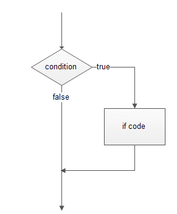
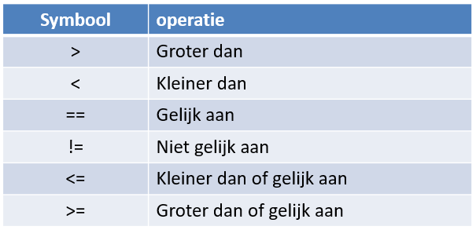
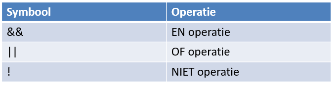
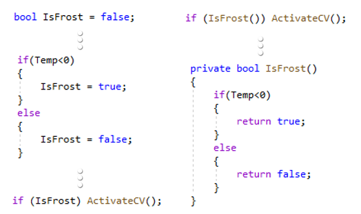
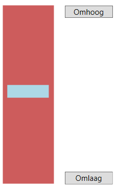

# Beslissingen
Het nemen van beslissingen doen wij als mens elke dag. In software is dat niet anders. Je hebt nu eenmaal situaties die geëvalueerd moeten worden en waaruit dan de juiste actie moet ondernomen worden.

bv. Is de temperatuur lager dan 20 graden, start dan de verwarming op.

## if

In c# kennen we daar de **if-opdracht** voor die een stukje code zal uitvoeren als aan een voorwaarde is voldaan.



Om de voorwaarde of conditie op te bouwen kunnen we onderstaande vergelijkingsoperatoren gebruiken:



:::tip Oefening 6.1

Schrijf een programma waar je in een textbox een paswoord kan ingeven en vervolgens op een knop "Login" klikken. Als het paswoord langer is dan 8 tekens geef je de textbox een groene kleur.
:::

## if-else

Vaak wil je ook een stukje code laten uitvoeren als de conditie niet voldaan is. In C# gebruiken we hiervoor de **if..else.. opdracht**.

:::tip Oefening 6.2

Pas de oefening 6.1 aan zodat de textbox nu ook rood kleurt als het paswoord niet langer is dan 8 tekens.
:::

## Opbouw van condities

Bij het uitschrijven van een conditie kan je ook verschillende voorwaarden combineren d.m.v. logische operatoren en het al dan niet plaatsen van haakjes.



:::tip Oefening 6.3

Probeer eens de conditie voor onderstaande situaties uit te schrijven op papier:
* Als het toerental hoger is dan 3000 rpm of de motor verbruikt meer dan 100 Kw moet een signaallamp gestuurd worden.
* Als de temperatuur van een sensor buiten de range 23-40 valt terwijl de druk sensor meer dan 25 bar aangeeft moet een alarm komen.
* Als het vriest en klep24 is niet gestuurd moet het verwarmingselement gestuurd worden. Dit moet ook gebeuren als de temperatuur lager dan -25 graden komt.
* De brander moet actief worden als de temperatuur lager is dan de 'dagtemperatuur' of als de temperatuur lager is dan de 'awaytemperatuur' als het huis in de stand 'nothome' staat.
* Als er minder dan 20 lux licht is en het is tussen 18u00 en 8u00 moet de buitenverlichting branden.
:::

:::warning Nota:
Een if-operatie kan in een andere if-operatie voorkomen. We spreken dan van een geneste if-structuur.
:::

:::tip Taak 9

**Oefening 6.4**

Schrijf een programma waarin 3 getallen via schuifregelaars kunnen ingesteld worden tussen 1 en 100. Na het drukken op de knop "Sort" worden de getallen gesorteerd van klein naar groot en in één label in die volgorde weergegeven.

**Tip**: Je kan de sortering in 3 stappen uitvoeren.

**Oefening 6.5**

Schrijf een programma dat uitrekent hoeveel iemand voor een bioscoopkaartje moet betalen. Je kan jouw leeftijd invoeren via een textbox en het correcte bedrag ontdekken via een "Ticket" knop.
* Jonger dan 5 jaar : gratis
* van 5 tot en met 12 jaar : halve prijs
* van 13 tot en met 55 jaar : volle prijs
* 55+ : gratis

Gebruik de huidige tarieven voor een bioscoopticket.

**Oefening 6.6**

Schrijf volgende gokprogramma:

* 1 deelname kost 10€ waarmee je 10 beurten krijgt.
* Per beurt worden 3 dobbelstenen geworpen (gebruik de random generator om die worpen te simuleren)
* Als er 3x een zes geworpen is krijg je 20€ winst
* Als er 3x een gelijk aantal ogen geworpen is maar geen zes krijg je 10€ winst.
* Als er 2x een gelijk aantal ogen geworpen is krijg je 5€ winst.

Bij de start van het programma is de totale winst 0€. Als je op de "Start" knop klikt wordt 10€ ingezet (winst wordt met 10€ verlaagt) en krijg je de knop "Worp" en is de knop "Start" tijdelijk uitgeschakeld. Die kan je 10x gebruiken waarmee telkens de dobbelstenen gesimuleerd worden en de eventuele winst opgeteld wordt. Na 10x is de knop "Worp" terug uitgeschakeld en de knop "Start" terug beschikbaar.

Voorzie ook een knop "Nieuwe speler" waarmee de winst terug op nul wordt gezet en het spel opnieuw kan beginnen.

Om het aantal worpen bij te houden visualiseer je dit via een progressbar.
:::

## switch

Stel dat je voor elke dag van de week een bepaald stukje programma moet kunnen uitvoeren. 
Met behulp van de if..else.. operator zou je 7 geneste ifs moeten gebruiken om dit te programmeren.
Dat zou onhandig en onnodig complex worden.

Daarom kunnen we gebruik maken van een **switch-operator** die steeds dezelfde variabele toetst aan een andere conditie.

```csharp
switch (dagnummer)
{
    case 1:
        dagnaam = "Maandag";
        break;
    case 2:
        dagnaam = "Dinsdag";
        break;
    case 3:
        dagnaam = "Woensdag";
        break;
    case 4:
        dagnaam = "Donderdag";
        break;
    case 5:
        dagnaam = "Vrijdag";
        break;
    case 6:
        dagnaam = "Zaterdag";
        break;
    case 7:
        dagnaam = "Zondag";
        break;        
}
```
Merk op dat groepering binnen de switch-operator ook tot de mogelijkheden behoort.

```csharp
switch (dagnummer)
{
    case 1:
    case 2:
    case 3:
    case 4:
    case 5:
        dagnaam = "Weekdag";
        break;
    case 6:
    case 7:
        dagnaam = "Weekend";
        break;        
}
```
## logische operator

Als we met logische operaties werken is de uitkomst steeds **true** (waar) of **false** (onwaar). Soms wil je die uitkomst tijdelijk bewaren in een variabele. Zo’n variabele noemen we een **boolean**.



:::tip Taak 10

**Oefening 6.7**

Schrijf een programma dat bij het aanklikken van een knop een willekeurige speelkaart selecteert en toont. Maak hierbij gebruik van de random generator om eerst te bepalen of het harten, ruiten, klaveren of schoppen is en gebruik die vervolgens opnieuw om te bepalen of de kaart een aas, 2..10, boer, vrouw of koning is.

Wie een extra uitdaging wenst kan de kaartafbeelding tonen i.p.v. via tekst.

**Oefening 6.8**

Schrijf een programma dat als een digitaal combinatieslot voor een kluis fungeert. Plaats drie knoppen "1", "2" en "3" op het scherm. Via die knoppen kan de gebruiker de cijfercombinatie invoeren. Toon deze combinatie terwijl men de invoer doet. Neem een cijfercombinatie van 6 cijfers. Als na 6 cijfers de code juist is verschijnt "De kluis is open". Zoniet wordt de combinatie gewist en kan een nieuwe poging ondernomen worden.

Voorzie eveneens een knop "Nieuwe code". Als die wordt ingedrukt kan de gebruiker via diezelfde knoppen "1", "2" en "3" een nieuwe combinatie voor de kluis invoeren. Na het 6de cijfer wordt de code bewaard en werkt het programma zoals voorheen.

**Oefening 6.9**

Schrijf een programma om een lift na te bootsen. Stel de liftkoker voor als een canvas en de lift zelf als een rechthoek. Voorzie twee knoppen "Omhoog" en "Omlaag". Als men op één van die knoppen drukt gaat de lift in stapjes in die richting gaan bewegen (gebruik hiervoor de DispatcherTimer). Eenmaal de lift ofwel volledig boven of beneden is wordt de respectievelijke knop uitgeschakeld tot zolang de lift in die positie staat.


:::

