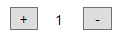
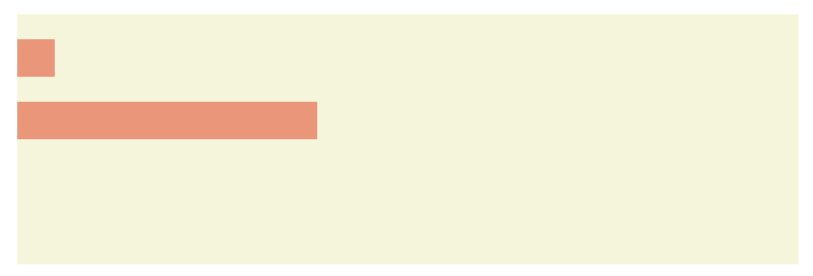

# Objecten

## instantievariabelen

Tot nu toe hebben we steeds met lokale variabelen gewerkt. Deze hebben een scope beperkt tot de methode waarin ze werden gedefinieerd. Echter in sommige gevallen hebben we behoefte aan variabelen die over meerdere methoden heen gebruikt kunnen worden. Zo'n variabele noemen we een **instantievariabele**.

Ze wordt als volgt gedefinieerd:

```csharp
public partial class MainWindow : Window
{
    // Hier plaats je alle instantievariabelen
    private int instantievariabele = 0;

    public MainWindow()
    {
        InitializeComponent();
    }
}
```

## Windows constructor
Als een programma opstart moeten soms stukjes code uitgevoerd worden die enkel bij de opstart nodig zijn. bv enkele parameters invullen. Dat deeltje in onze softwarecode noemen we de **Windows constructor**.

```csharp
public partial class MainWindow : Window
{
    // Hier plaats je alle instantievariabelen
    private int instantievariabele;

    // Windows constructor
    public MainWindow()
    {
        InitializeComponent();
        // Hier plaats je alle code die bij de opstart eenmalig moet uitgevoerd worden
        instantievariabele = 0;
    }
}
```

:::tip Oefening

**5.1** Schrijf een programma met volgende user interface :

```yaml
<Grid>
        <Slider Name="sld_V" IsDirectionReversed="True" Orientation="Vertical" HorizontalAlignment="Left" Margin="50,10,0,0" VerticalAlignment="Top" Height="250" ValueChanged="sld_V_ValueChanged"/>
        <Slider Name="sld_H" HorizontalAlignment="Left" Margin="75,275,0,0" VerticalAlignment="Top" Width="250" ValueChanged="sld_H_ValueChanged"/>
        <Canvas Name="paperCanvas" HorizontalAlignment="Left" VerticalAlignment="Top" Margin="75,10,0,0" Background="Beige" Height="250" Width="250"/>
        <Label Name="lblVertical" Content="0" HorizontalAlignment="Left" Margin="10,135,0,0" VerticalAlignment="Top"/>
        <Label Name="lblHorizontal" Content="0" HorizontalAlignment="Left" Margin="175,300,0,0" VerticalAlignment="Top"/>
</Grid>
```

Vervolledig het programma met volgende sourcecode:

```csharp
public partial class MainWindow : Window
    {
        // instantie variabele
        private Ellipse ellipse = new Ellipse();

        // windows constructor
        public MainWindow()
        {
            InitializeComponent();

            // constructor code
            sld_V.Minimum = 1; sld_V.Value = 1;
            sld_V.Maximum = paperCanvas.Height;

            sld_H.Minimum = 1; sld_H.Value = 1;
            sld_H.Maximum = paperCanvas.Width;
            lblVertical.Content = Convert.ToString(sld_V.Value);
            lblHorizontal.Content = Convert.ToString(sld_H.Value);

            CreateEllipse();
        }

        private void CreateEllipse()
        {
            ellipse.Width = sld_H.Value;
            ellipse.Height = sld_V.Value;
            ellipse.Stroke = new SolidColorBrush(Colors.Blue);
            ellipse.Margin = new Thickness(0, 0, 0, 0);
            paperCanvas.Children.Add(ellipse);
        }

        private void UpdateEllipse()
        {
            ellipse.Width = sld_H.Value;
            ellipse.Height = sld_V.Value;
        }

        private void sld_V_ValueChanged(object sender, RoutedPropertyChangedEventArgs<double> e)
        {
            int vertical = Convert.ToInt32(sld_V.Value);
            lblVertical.Content = Convert.ToString(vertical);
            UpdateEllipse();
        }

        private void sld_H_ValueChanged(object sender, RoutedPropertyChangedEventArgs<double> e)
        {
            int horizontal = Convert.ToInt32(sld_H.Value);
            lblHorizontal.Content = Convert.ToString(horizontal);
            UpdateEllipse();
        }
    }
```

Probeer het programma te begrijpen. 

**Vragen:**
* Waarom wordt gebruik gemaakt van een instantievariabele ?
* Waarom worden bepaalde zaken in de windows constructor uitgevoerd ?
* Wat is de functie van de methoden `CreateEllipse()` en `UpdateEllipse()`?
:::

::: tip Taak 7

**5.2** Schrijf een programma met volgende interface:


Wanneer de "Set" knop wordt aangeklikt, worden de nieuwe minimum en maximum voor de schuifregelaar ingesteld. Bij het verplaatsen van de schuifregelaar wordt de waarde in het label getoond.

**5.3** Schrijf een programma dat in het begin het getal 1 op een label laat zien. Door het aanklikken van de + of - knop wordt de waarde telkens met 1 verhoogd of verlaagd. Maak gebruik van een private variabele, die geïnitialiseerd is op 1 en stel het label in de constructor in.



**5.4** Schrijf een programma dat graden Celcius naar graden Fahrenheit omzet. De Celcius-waarde moet via een slider ingevoerd worden. De waarden in Celcius en Fahrenheit worden dan ogenblikkelijk getoond in labels alsook in een balkgrafiek.
```csharp
int f = c * 9 / 5 + 32;
```


:::

## Namespaces
Omdat we niet telkens alles zelf zouden moeten schrijven heeft de .NET omgeving een enorme bibliotheek aan reeds voorgeschreven stukjes code die we in onze programma’s kunnen gebruiken. Die stukjes noemen we **namespaces**.

We kunnen die als volgt toevoegen aan onze code:

```csharp
using System.IO;
```

Het vergt soms wat opzoekwerk om te vinden wat er reeds is en welke namespace je dan precies moet aanspreken. De uitgebreide informatie van [.net](https://docs.microsoft.com/en-us/dotnet/csharp/) kan hierbij een hulp zijn.

:::tip Oefeningen

**5.5** Om willekeurige getallen te genereren maken we gebruik van een nieuwe class **Random**. Deze is reeds aanwezig in de standaard namespaces dus is er geen behoefte aan een extra **namespace**, dus hebben we geen nood aan een **using** verwijzing.

De user-interface ziet er als volgt uit:

```yaml
<Grid>
        <Label Content="The computer guesses that your age is" HorizontalAlignment="Left" Margin="25,25,0,0" VerticalAlignment="Top"/>
        <Label Name="lblAge" Content="0" HorizontalAlignment="Left" Margin="250,25,0,0" VerticalAlignment="Top"/>
        <Button Name="btnWrong" Content="Wrong" HorizontalAlignment="Left" Margin="25,50,0,0" VerticalAlignment="Top" Width="75" Click="BtnWrong_Click"/>
        <Button Name="btnCorrect" Content="Correct" HorizontalAlignment="Left" Margin="125,50,0,0" VerticalAlignment="Top" Width="75" Click="BtnCorrect_Click"/>
</Grid>
```
Voeg volgende sourcecode toe:

```csharp
public partial class MainWindow : Window
{
    private int tries = 0;
    private Random ageGuesser = new Random();

    public MainWindow()
    {
        InitializeComponent();
        lblAge.Content = Convert.ToString(ageGuesser.Next(5, 110));
    }

    private void BtnWrong_Click(object sender, RoutedEventArgs e)
    {
        tries++;
        lblAge.Content = Convert.ToString(ageGuesser.Next(5, 110));
    }

    private void BtnCorrect_Click(object sender, RoutedEventArgs e)
    {
        tries++;
        MessageBox.Show($"Number of tries was: {tries}");
        tries = 0;
        lblAge.Content = Convert.ToString(ageGuesser.Next(5, 110));
    }
}
```

**Vragen**

Zoek informatie over de class Random op en beantwoord volgende vragen:
 
* Kan je enkel `integers` genereren met de Random class?
* `.Next(5,10)` levert dit getallen op tussen 5 en 10 inclusief de grenswaarden of niet?
* Als je meerdere willekeurige getallen nodig hebt, moet je dan ook meerdere Random variabelen aanmaken?

**5.6** Om tijdsgebonden code te kunnen uitvoeren maken we gebruik van een nieuwe class **DispatcherTimer** uit een nieuwe **namespace System.Windows.Threading**, dus hebben we nood aan een **using** verwijzing.
De user-interface ziet er als volgt uit:

```yaml
<Grid>
        <Button Name="btnStart" Content="Start" HorizontalAlignment="Left" Margin="25,25,0,0" VerticalAlignment="Top" Width="75" Click="BtnStart_Click"/>
        <Button Name="btnStop" Content="Stop" HorizontalAlignment="Left" Margin="25,50,0,0" VerticalAlignment="Top" Width="75" Click="BtnStop_Click"/>
        <Button Name="btnClear" Content="Clear" HorizontalAlignment="Left" Margin="25,75,0,0" VerticalAlignment="Top" Width="75" Click="BtnClear_Click"/>
        <Label Name="lblGap" Content="10" HorizontalAlignment="Left" Margin="25,350,0,0" VerticalAlignment="Top"/>
        <Slider Name="Slider" Minimum="1" Maximum="100" HorizontalAlignment="Left" Margin="25,300,0,0" VerticalAlignment="Top" Width="75" ValueChanged="Slider_ValueChanged"/>
        <Canvas Name="paperCanvas" HorizontalAlignment="Left" Height="350" Margin="125,25,0,0" VerticalAlignment="Top" Width="350" Background="Beige"/>
</Grid>
```

Voeg volgende sourcode toe:

```csharp
public partial class MainWindow : Window
{
   // instantie variabelen
   private Random randomNumber = new Random();
   private double x, y, size;
   private SolidColorBrush brush;
   private DispatcherTimer timer = new DispatcherTimer();

   public MainWindow()
   {
       InitializeComponent();
       // Constructor code
       lblGap.Content = Convert.ToString(Slider.Value);
       brush = new SolidColorBrush(Colors.Blue);
       timer.Interval = TimeSpan.FromMilliseconds(Slider.Value);
       timer.Tick += timer_Tick;
       Slider.Value = 10;
   }

   // Stop de timer
   private void BtnStop_Click(object sender, RoutedEventArgs e)
   {
       timer.Stop();
   }

   // Wis het canvas
   private void BtnClear_Click(object sender, RoutedEventArgs e)
   {
       paperCanvas.Children.Clear();
   }

   // Nieuw maximum voor het tijdsinterval
   private void Slider_ValueChanged(object sender, RoutedPropertyChangedEventArgs<double> e)
   {
       lblGap.Content = Convert.ToString(Slider.Value);
   }

   // Start de timer
   private void BtnStart_Click(object sender, RoutedEventArgs e)
   {
       timer.Start();
   }

   // Code die bij elke tick van de timer wordt uitgevoerd
   private void timer_Tick(object sender, EventArgs e)
   {
       // willekeurige waarden voor x, y en size 
       x = randomNumber.Next(0, Convert.ToInt32(paperCanvas.Width));
       y = randomNumber.Next(0, Convert.ToInt32(paperCanvas.Height));
       size = randomNumber.Next(1, 40);

       // de nieuwe ellipse toevoegen
       Ellipse ellipse = new Ellipse();
       ellipse.Width = size;
       ellipse.Height = size;
       ellipse.Stroke = brush;
       ellipse.Fill = brush;
       ellipse.Margin = new Thickness(x, y, 0, 0);
       paperCanvas.Children.Add(ellipse);

       // Een nieuw willekeurig tijdsinteval instellen
       timer.Stop();
       int ms = randomNumber.Next(1, Convert.ToInt32(Slider.Value));
       timer.Interval = TimeSpan.FromMilliseconds(ms);
       timer.Start();
    }
}
```

**Vragen**

* Probeer op een tijdslijn weer te geven wat er precies gebeurt met de class DispatcherTimer.
* Wat is de functie van ` timer.Tick += timer_Tick;`?
:::

:::tip Taak 8

**5.7** Schrijf een programma dat telkens je op de knop "Next" klikt een nieuw willekeurig getal tussen 200 en 400 genereert. Het getal wordt in een label getoond samen met de som en het gemiddelde van alle tot nu toe gegenereerde getallen.

**Controle**: Als je doorgaat met klikken moet het gemiddelde dichter en dichter bij 300 komen te liggen.

**5.8** Schrijf een programma dat de inhoud van een zwembad bepaalt en tevens de dwarsdoorsnede ervan in een canvas laat zien. De breedte van het zwembad is 5 meter en de lengte 20 meter. De minimum diepte aan beide uiteinden is 1 meter en kan gewijzigd worden door twee sliders.

```csharp
int gemdiepte = ( diepte1 + diepte2 ) / 2;
int volume = gemdiepte * breedte * lengte;
```


**5.9** Schrijf een programma dat het aantal minuten en seconden dat het programma loopt laat zien door twee balken te tonen op een canvas. Maak de canvas 600 pixels breed zodat elke minuut of seconde met 10 pixels overeenkomt.

**Tip** Maak gebruik van een timer die elke seconde iets doet. Het totaal aantal seconden kan je converteren naar minuten en seconden via de / en % operatoren. Om het programma te testen kan je het tijdsinterval verkleinen.


:::