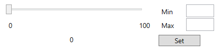
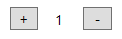
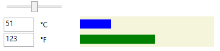
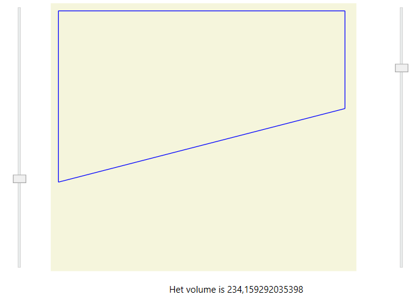
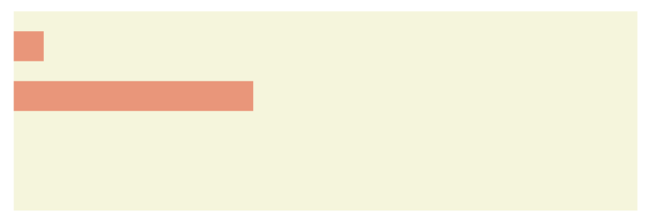

# Taak 6 - Programmeren met objecten


## Opdrachten

**1.** Schrijf een programma met volgende interface:



Wanneer de "Set" knop wordt aangeklikt, worden de nieuwe minimum en maximum voor de schuifregelaar ingesteld. Bij het verplaatsen van de schuifregelaar wordt de waarde in het label getoond.

**2.** Schrijf een programma dat in het begin het getal 1 op een label laat zien. Door het aanklikken van de + of - knop wordt de waarde telkens met 1 verhoogd of verlaagd. Maak gebruik van een private variabele, die geïnitialiseerd is op 1 en stel het label in de constructor in.



**3.** Schrijf een programma dat graden Celcius naar graden Fahrenheit omzet. De Celcius-waarde moet via een slider ingevoerd worden. De waarden in Celcius en Fahrenheit worden dan ogenblikkelijk getoond in labels alsook in een balkgrafiek.
```csharp
int f = c * 9 / 5 + 32;
```



**4.** Schrijf een programma dat telkens je op de knop "Next" klikt een nieuw willekeurig getal tussen 200 en 400 genereert. Het getal wordt in een label getoond samen met de som en het gemiddelde van alle tot nu toe gegenereerde getallen.

**Controle**: Als je doorgaat met klikken moet het gemiddelde dichter en dichter bij 300 komen te liggen.

**5.** Schrijf een programma dat de inhoud van een zwembad bepaalt en tevens de dwarsdoorsnede ervan in een canvas laat zien. De breedte van het zwembad is 5 meter en de lengte 20 meter. De minimum diepte aan beide uiteinden is 1 meter en kan gewijzigd worden door twee sliders.

```csharp
int gemdiepte = ( diepte1 + diepte2 ) / 2;
int volume = gemdiepte * breedte * lengte;
```


**6.** Schrijf een programma dat het aantal minuten en seconden dat het programma loopt laat zien door twee balken te tonen op een canvas. Maak de canvas 600 pixels breed zodat elke minuut of seconde met 10 pixels overeenkomt.

**Tip** Maak gebruik van een timer die elke seconde iets doet. Het totaal aantal seconden kan je converteren naar minuten en seconden via de / en % operatoren. Om het programma te testen kan je het tijdsinterval verkleinen.



## Tips

* Overloop de leerstof van objecten nog even voor je hieraan begint.
* Verzorg je naamgeving van objecten.
* Lees de opdrachten goed en werk met een checklist, vink af wat klaar is.

## Evaluatie

Deze opdracht staat op **15%** van de totale score voor basic programming 2.

De evaluatie gebeurt op basis van:
* Is jou code geschreven de good practices van programmeren?
* Het product: Doet het programma wat er gevraagd is?
* Het proces: Hoe is het programma geschreven?
