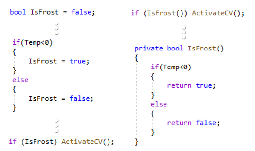

# Beslissingen
Het nemen van beslissingen doen wij als mens elke dag. In software is dat niet anders. Je hebt nu eenmaal situaties die geëvalueerd moeten worden en waaruit dan de juiste actie moet ondernomen worden.

bv. Is de temperatuur lager dan 20 graden, start dan de verwarming op.

## if

In c# kennen we daar de **if-opdracht** voor die een stukje code zal uitvoeren als aan een voorwaarde is voldaan.


Om de voorwaarde of conditie op te bouwen kunnen we onderstaande vergelijkingsoperatoren gebruiken:


:::tip Oefening

**7.1** Schrijf een programma waar je in een textbox een paswoord kan ingeven en vervolgens op een knop "Login" klikken. Als het paswoord langer is dan 8 tekens geef je de textbox een groene kleur.
:::

## if-else

Vaak wil je ook een stukje code laten uitvoeren als de conditie niet voldaan is. In C# gebruiken we hiervoor de **if..else.. opdracht**.

:::tip Oefening

**7.2** Pas de oefening 6.1 aan zodat de textbox nu ook rood kleurt als het paswoord niet langer is dan 8 tekens.
:::

## Opbouw van condities

Bij het uitschrijven van een conditie kan je ook verschillende voorwaarden combineren d.m.v. logische operatoren en het al dan niet plaatsen van haakjes.


:::tip Oefening

**7.3** Probeer eens de conditie voor onderstaande situaties uit te schrijven op papier:
* Als het toerental hoger is dan 3000 rpm of de motor verbruikt meer dan 100 Kw moet een signaallamp gestuurd worden.
* Als de temperatuur van een sensor buiten de range 23-40 valt terwijl de druk sensor meer dan 25 bar aangeeft moet een alarm komen.
* Als het vriest en klep24 is niet gestuurd moet het verwarmingselement gestuurd worden. Dit moet ook gebeuren als de temperatuur lager dan -25 graden komt.
* De brander moet actief worden als de temperatuur lager is dan de 'dagtemperatuur' of als de temperatuur lager is dan de 'awaytemperatuur' als het huis in de stand 'nothome' staat.
* Als er minder dan 20 lux licht is en het is tussen 18u00 en 8u00 moet de buitenverlichting branden.
:::

:::warning Nota:
Een if-operatie kan in een andere if-operatie voorkomen. We spreken dan van een geneste if-structuur.
:::

## Switch

Stel dat je voor elke dag van de week een bepaald stukje programma moet kunnen uitvoeren. 
Met behulp van de if..else.. operator zou je 7 geneste ifs moeten gebruiken om dit te programmeren.
Dat zou onhandig en onnodig complex worden.

Daarom kunnen we gebruik maken van een **switch-operator** die steeds dezelfde variabele toetst aan een andere conditie.

```csharp
switch (dagnummer)
{
    case 1:
        dagnaam = "Maandag";
        break;
    case 2:
        dagnaam = "Dinsdag";
        break;
    case 3:
        dagnaam = "Woensdag";
        break;
    case 4:
        dagnaam = "Donderdag";
        break;
    case 5:
        dagnaam = "Vrijdag";
        break;
    case 6:
        dagnaam = "Zaterdag";
        break;
    case 7:
        dagnaam = "Zondag";
        break;        
}
```
Merk op dat groepering binnen de switch-operator ook tot de mogelijkheden behoort.

```csharp
switch (dagnummer)
{
    case 1:
    case 2:
    case 3:
    case 4:
    case 5:
        dagnaam = "Weekdag";
        break;
    case 6:
    case 7:
        dagnaam = "Weekend";
        break;        
}
```
## Logische operator

Als we met logische operaties werken is de uitkomst steeds **true** (waar) of **false** (onwaar). Soms wil je die uitkomst tijdelijk bewaren in een variabele. Zo’n variabele noemen we een **boolean**.



::: tip Taak 7 - Programmeren met beslissigen


* [Opdrachtfiche](assignment.html)
:::
