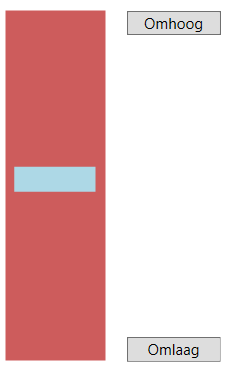

# Taak 7 - Programmeren met beslissingen

## Opdrachten

**1.** Schrijf een programma waarin 3 getallen via schuifregelaars kunnen ingesteld worden tussen 1 en 100. Na het drukken op de knop "Sort" worden de getallen gesorteerd van klein naar groot en in één label in die volgorde weergegeven.

**Tip**: Je kan de sortering in 3 stappen uitvoeren.

**2.** Schrijf een programma dat uitrekent hoeveel iemand voor een bioscoopkaartje moet betalen. Je kan jouw leeftijd invoeren via een textbox en het correcte bedrag ontdekken via een "Ticket" knop.
* Jonger dan 5 jaar : gratis
* van 5 tot en met 12 jaar : halve prijs
* van 13 tot en met 55 jaar : volle prijs
* 55+ : gratis

Gebruik de huidige tarieven voor een bioscoopticket.

**3.** Schrijf volgende gokprogramma:

* 1 deelname kost 10€ waarmee je 10 beurten krijgt.
* Per beurt worden 3 dobbelstenen geworpen (gebruik de random generator om die worpen te simuleren)
* Als er 3x een zes geworpen is krijg je 20€ winst
* Als er 3x een gelijk aantal ogen geworpen is maar geen zes krijg je 10€ winst.
* Als er 2x een gelijk aantal ogen geworpen is krijg je 5€ winst.

Bij de start van het programma is de totale winst 0€. Als je op de "Start" knop klikt wordt 10€ ingezet (winst wordt met 10€ verlaagt) en krijg je de knop "Worp" en is de knop "Start" tijdelijk uitgeschakeld. Die kan je 10x gebruiken waarmee telkens de dobbelstenen gesimuleerd worden en de eventuele winst opgeteld wordt. Na 10x is de knop "Worp" terug uitgeschakeld en de knop "Start" terug beschikbaar.

Voorzie ook een knop "Nieuwe speler" waarmee de winst terug op nul wordt gezet en het spel opnieuw kan beginnen.

Om het aantal worpen bij te houden visualiseer je dit via een progressbar.

**4.** Schrijf een programma dat bij het aanklikken van een knop een willekeurige speelkaart selecteert en toont. Maak hierbij gebruik van de random generator om eerst te bepalen of het harten, ruiten, klaveren of schoppen is en gebruik die vervolgens opnieuw om te bepalen of de kaart een aas, 2..10, boer, vrouw of koning is.

Wie een extra uitdaging wenst kan de kaartafbeelding tonen i.p.v. via tekst.

**5.** Schrijf een programma dat als een digitaal combinatieslot voor een kluis fungeert. Plaats drie knoppen "1", "2" en "3" op het scherm. Via die knoppen kan de gebruiker de cijfercombinatie invoeren. Toon deze combinatie terwijl men de invoer doet. Neem een cijfercombinatie van 6 cijfers. Als na 6 cijfers de code juist is verschijnt "De kluis is open". Zoniet wordt de combinatie gewist en kan een nieuwe poging ondernomen worden.

Voorzie eveneens een knop "Nieuwe code". Als die wordt ingedrukt kan de gebruiker via diezelfde knoppen "1", "2" en "3" een nieuwe combinatie voor de kluis invoeren. Na het 6de cijfer wordt de code bewaard en werkt het programma zoals voorheen.

**6.** Schrijf een programma om een lift na te bootsen. Stel de liftkoker voor als een canvas en de lift zelf als een rechthoek. Voorzie twee knoppen "Omhoog" en "Omlaag". Als men op één van die knoppen drukt gaat de lift in stapjes in die richting gaan bewegen (gebruik hiervoor de DispatcherTimer). Eenmaal de lift ofwel volledig boven of beneden is wordt de respectievelijke knop uitgeschakeld tot zolang de lift in die positie staat.

## Tips

* Overloop de leerstof van beslissingen nog even voor je hieraan begint.
* Verzorg je naamgeving van objecten.
* Lees de opdrachten goed en werk met een checklist, vink af wat klaar is.

## Evaluatie

Deze opdracht staat op **20%** van de totale score voor basic programming 2.

De evaluatie gebeurt op basis van:
* Is jou code geschreven de good practices van programmeren?
* Het product: Doet het programma wat er gevraagd is?
* Het proces: Hoe is het programma geschreven?
