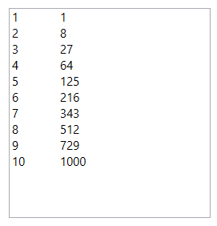
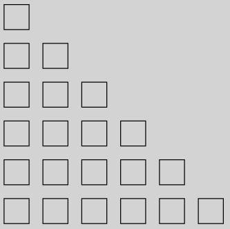
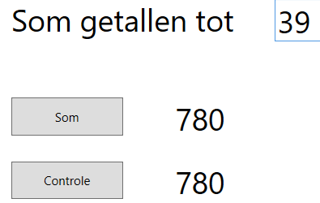
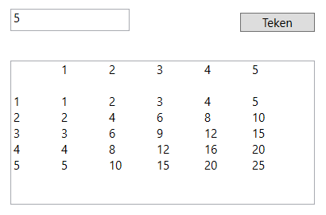
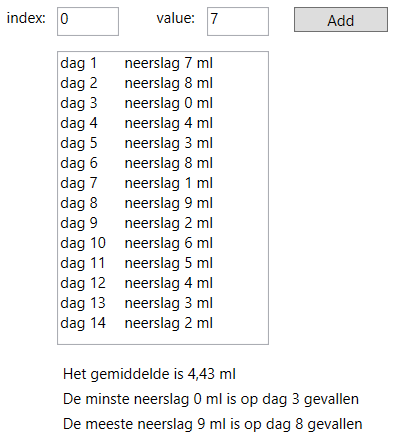

# Herhalingen

Als we een stukje code enkele malen moeten uitvoeren dan kunnen we gebruik maken van de **herhaling-structuur** in c#. We onderscheiden :
* De FOR-lus
* De WHILE-lus
* De DO-lus

## FOR-lus

We gebruiken de FOR-lus als we **op voorhand het aantal herhalingen kennen**.

Een FOR-lus ziet er typisch als volgt uit:
```csharp
for( int i=1 ; i<10 ; i++ ) {

    // Hier komt dan het stukje code die zich moet herhalen

}
```
> **Oefening 7.1**
>
> Schrijf een programma met volgende user interface :
>```yaml
> <Grid>
>        <Canvas Name="paperCanvas" Background="Beige" HorizontalAlignment="Left" Height="100" Margin="25,75,0,0" VerticalAlignment="Top" Width="600"/>
>        <Slider Name="countSlider" Minimum="1" Maximum="24" Width="600" HorizontalAlignment="Left" Margin="25,25,0,0" VerticalAlignment="Top" ValueChanged="CountSlider_ValueChanged"/>
>    </Grid>
>```
>
>En volgende sourcecode:
>
>```csharp
>public partial class MainWindow : Window
>{
>   public MainWindow()
>   {
>       InitializeComponent();
>   }
>
>   private void CountSlider_ValueChanged(object sender, RoutedPropertyChangedEventArgs<double> e)
>   {
>       double x = 5;
>       int numberOfBoxes = Convert.ToInt32(countSlider.Value);
>       var brush = new SolidColorBrush(Colors.Black);
>       paperCanvas.Children.Clear();
>       for(int counter = 1; counter <= numberOfBoxes; counter++)
>       {
>            DrawRectangle(paperCanvas, brush, x, 15, 15, 15);
>            x = x + 25;
>       }
>   }
> 
>   private void DrawRectangle(Canvas paperCanvas, SolidColorBrush brush, double x, double y, int width, int height)
>   {
>       Rectangle rectangle = new Rectangle()
>       {
>           Width = width,
>           Height = height,
>           Margin = new Thickness(x, y, 0, 0),
>           Stroke = brush
>       };
>       paperCanvas.Children.Add(rectangle);
>   }
>}
>```
>
>Het aantal keer dat de lus doorlopen wordt is wel is waar variabel, maar net op het moment dat de lus moet starten is die waarde wel gekend en dus weten we hoeveel keer de lus zal doorlopen worden.
>

> **Taak 11**
>
> **Oefening 7.2**
>
>Schrijf een programma dat met behulp van een lus de getallen 1 t.e.m. 10 en de derde macht hiervan op het scherm laat zien.

>
> **Oefening 7.3**
>
>Schrijf een programma dat met behulp van een lus willekeurige getallen tussen 1 en 100 op het scherm toont in een tekstvak.
>
> **Oefening 7.4**
>
>Schrijf een programma dat 100 cirkels met willekeurige stralen tot 100 pixels op willekeurige posities in een canvas van 500x500 tekent.
> 
> **Oefening 7.5**
>
>Schrijf een programma dat een trap van vierkantjes tekent. Elk vierkantje wordt met een methode 'DrawRectangle' getekend.


## WHILE-lus

We gebruiken de WHILE-lus als we ** niet op voorhand weten hoeveel herhalingen er zullen zijn**. De WHILE-lus zal eerst de conditie voor herhaling bekijken en pas als deze nog geldig is zal een lus worden uitgevoergd. **Het is dus mogelijk dat er dus nooit een lus wordt uitgevoerd!**

Een WHILE-lus ziet er typisch als volgt uit:
```csharp
int i=0;

while ( (i<10) && ( temp > 0 ) )
{

    // Hier komt dan het stukje code die zich moet herhalen

    i++; // belangrijk: als je dit vergeet krijg je een eindloze loop!
}
```
> **Oefening 7.6**
>
> Schrijf een programma met volgende user interface :
>```yaml
><Grid>
>   <Button Name="btnCalc" Content="Calculate" HorizontalAlignment="Left" Margin="25,25,0,0" VerticalAlignment="Top" Width="75" Click="BtnCalc_Click"/>
>   <TextBox Name="tbxResult" HorizontalAlignment="Left" Height="300" Margin="125,25,0,0" TextWrapping="Wrap" Text="" VerticalAlignment="Top" Width="300"/>
></Grid>
>```
>
>En met volgende sourcecode:
>```csharp
>public partial class MainWindow : Window
>{
>   public MainWindow()
>   {
>       InitializeComponent();
>   }
>
>   private void BtnCalc_Click(object sender, RoutedEventArgs e)
>   {
>       int numberOfSquares = 1;
>       int amoutOfRice = 1;
>       int total = 1;
>       tbxResult.Clear();
>       DisplayCounts(numberOfSquares, amoutOfRice);
>
>       while ( total < 100 )
>       {
>           numberOfSquares++;
>           amoutOfRice = amoutOfRice * 2;
>           DisplayCounts(numberOfSquares, amoutOfRice);
>           total = total + amoutOfRice;
>       }
>
>       tbxResult.AppendText(Environment.NewLine);
>       tbxResult.AppendText("Number of squares to make total " + $"of 100 is { numberOfSquares }");           
>   }
>
>   private void DisplayCounts(int square, int rice)
>   {
>       tbxResult.AppendText($"on square {square} are {rice} grains");
>       tbxResult.AppendText(Environment.NewLine);
>   }
>}
>```
## DO-lus

De DO-lus werkt identiek aan de WHILE-lus met dat verschil dat hier eerst een lus wordt uitgevoerd en dan gekeken wordt of de conditie goed is om er nog eentje uit te voeren.

Een DO-lus ziet er typisch als volgt uit:
```csharp
int i=0;

do {
    // Hier komt dan het stukje code die zich moet herhalen

    i++; // belangrijk: als je dit vergeet krijg je een eindloze loop!
} while ( (i<10) && ( temp > 0 ) );
```
## Array

Tot nu toe hebben we steeds gewerkt met variabelen die één enkele waarde bevatten. Maar soms heb je behoefte aan een tabel van waarden.

Dan kan je gebruik maken van een **array**.

Een array definieer je bv als volgt:
```csharp
// een array leeftijd van 6 integers
int[] leeftijd = new int[6];
// een array dagen van strings 
string[] dagen = {"Maandag","Dinsdag","Woensdag","Donderdag","Vrijdag","Zaterdag","Zondag"};
```
De positie binnen een array noemen we de **index** en begint steeds bij **nul**.

Als we dus schrijven:
```csharp
temp[5] = 24;
```
Dan stellen we de 6de waarde in de array temp gelijk aan 24!

Om te weten hoe groot een array is kan je het volgende schrijven:
```csharp
int lengte = tabel.Length;
```
Hiermee stel je de variabele lengte gelijk aan het aantal waarden in de array tabel.

Een array kan je ook als parameter doorgeven aan een methode. Je gaat hiervoor als volgt te werk:
```csharp
int[] tabel = new int[24];

// oproepen methode
int totaal = Sum(tabel);

// methode Sum
private int Sum(int[] getallen)
{
    int totaal = 0;
    for(int i = 0; i<getallen.Length;i++){
        totaal += getallen[i];
    }
    return totaal;
}
```
> **Taak 12**
>
> **Oefening 7.7**
>
>Schrijf een programma dat de getallen 0 t.e.m. 39 met behulp van een lus optelt en plaats het resultaat in een label. Voorzie een controle en toon het controleresultaat eveneens in een label.
>```csharp
>int som = n * ( n + 1 ) / 2;
>```
>Pas vervolgens het programma aan zodat n kan ingegeven worden i.p.v. een vaste waarde 39.
>
>
> **Oefening 7.8**
>
>Schrijf een programma dat een vermenigvuldigingstabel laat zien. Hieronder een voorbeeld voor 1 t.e.m. 5:
>
>Zorg er voor dat je het bereik tot waar de tabel moet weergegeven worden kan ingevuld worden. Zorg dat er een horizontale en verticale scrollbar steeds aanwezig is.
>**tip:** In een string de code `\t` toevoegen zorgt voor een tab.
>
> **Oefening 7.9**
>
>Schrijf een programma dat de som van volgende reeks weet te berekenen en op het scherm toont.
Je blijft optellen in de reeks tot de term een waarde heeft bereikt die kleiner is dan 0,0001.
>
> 1 - 1/2 + 1/3 - 1/4 + ...
>
> **Oefening 7.10**
>
>Schrijf een programma waar de gebruiker voor een periode van 14 dagen het aantal ml neerslag kan inbrengen. Elke waarde wordt op een nieuwe regel in een textbox getoont. Als de laatste dag is ingebracht worden volgende gegevens op het scherm getoont:
>* de gemiddelde neerslag gedurende die periode
>* de hoogste en laagste waarde van de neerslag
>* de dagen waarop die hoogste en laagste waarde zijn voorgekomen.
>
>**tip**: maak gebruik van een array


