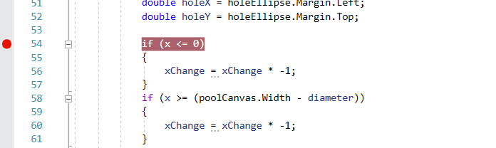

# Debuggen
Niet alle code dat we schijven loopt van de eerste keer prima.
Dan berust ons de moeilijke taak om uit te zoeken waar het fout loopt. Dit noemen we **debuggen**.

Sterker nog, zelfs al loopt het op het eerste zicht allemaal prima, een goede programmeur zal via het debuggen allerhande mogelijkheden uittesten om te zien of het programma naar behoren werkt.

## Breakpoint
We kunnen in onze code breakpoints toevoegen. Dit zijn plaatsen in de code waar het programma even zal halt houden. We kunnen dit doen door voor een lijnnummer te klikken, er verschijnt een rode bol op die plaats.

Je hebt dan de keuze om het programma via **Continue** zich gewoon te laten verderzetten of via **Stop debugging** te beëindigen. Je gebruikt die keuzes uiteraard eenmaal je een fout hebt ontdekt en die wil aanpassen.

Om effectief op zoek te gaan naar problemen kan je gebruik maken van:
* **Step Into**: zal de volgende coderegel uitvoeren, deze gaat ook in methodes de individuele regels debuggen.
* **Step Over**: zal de volgende coderegel uitvoeren, bij een methode wordt de methode gewoon uitgevoerd zonder elke individuele regel van de methode te gaan debuggen.
* **step Out**: zal de huidige methode afwerken en pas terug stoppen bij de volgende coderegel buiten de methode. Je stapt als het ware uit de methode.

## Watchlist

Terwijl je aan het debuggen bent kan je met je cursor boven elke variabele hoveren om zo de waarde ervan te zien.

Handig maar ook best vervelend als je meerdere variabelen gelijktijdig wil controleren. Hiervoor gebruiken we dan een **watchlist**. 

Een variabele voeg je toe aan de wachtlist via het rechtermuismenu.

 

Op die manier kan je bij elke stap tijdens het debuggen de voor jou belangrijke variabelen bijhouden om te zien of alles naar behoren functioneert.

 