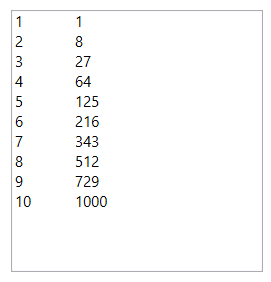
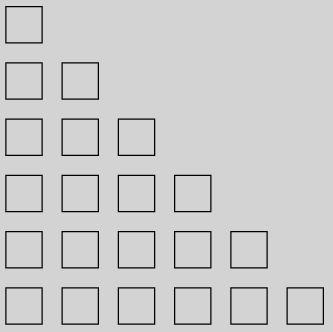
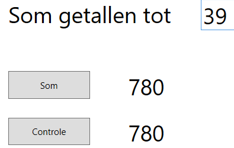
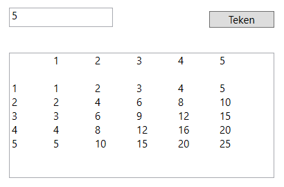
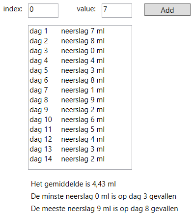

# Taak 8 - Programmeren met herhalingen


## Opdrachten

**1.** Schrijf een programma dat met behulp van een lus de getallen 1 t.e.m. 10 en de derde macht hiervan op het scherm laat zien.



**2.** Schrijf een programma dat met behulp van een lus 10 willekeurige getallen tussen 1 en 100 op het scherm toont in een tekstvak.

**3.** Schrijf een programma dat 100 cirkels met willekeurige stralen tot 25 pixels op willekeurige posities in een canvas van 500x500 tekent.
 
**4.** Schrijf een programma dat een trap van vierkantjes tekent. Elk vierkantje wordt met een methode 'DrawRectangle' getekend.



**5.** Schrijf een programma dat de getallen 0 t.e.m. 39 met behulp van een lus optelt en plaats het resultaat in een label. Voorzie een controle en toon het controleresultaat eveneens in een label.

```csharp
int som = n * ( n + 1 ) / 2;
```
Pas vervolgens het programma aan zodat n kan ingegeven worden i.p.v. een vaste waarde 39.



**6.** Schrijf een programma dat een vermenigvuldigingstabel laat zien. Hieronder een voorbeeld voor 1 t.e.m. 5:



Zorg er voor dat het bereik tot waar de tabel moet weergegeven worden kan ingevuld worden. Zorg dat er een horizontale en verticale scrollbar steeds aanwezig is.

**tip:** In een string de code `\t` toevoegen zorgt voor een tab.

**7.** Schrijf een programma dat de som van volgende reeks weet te berekenen en op het scherm toont.
Je blijft optellen in de reeks tot de term een waarde heeft bereikt die kleiner is dan 0,0001.

1 - 1/2 + 1/3 - 1/4 + ...

**8.** Schrijf een programma waar de gebruiker voor een periode van 14 dagen het aantal ml neerslag kan inbrengen. Elke waarde wordt op een nieuwe regel in een textbox getoont. Als de laatste dag is ingebracht worden volgende gegevens op het scherm getoont:
* de gemiddelde neerslag gedurende die periode;
* de hoogste en laagste waarde van de neerslag;
* de dagen waarop die hoogste en laagste waarde zijn voorgekomen.



**tip**: maak gebruik van een array.

## Tips

* Overloop de leerstof van herhalingen nog even voor je hieraan begint.
* Verzorg je naamgeving van objecten.
* Lees de opdrachten goed en werk met een checklist, vink af wat klaar is.

## Evaluatie

Deze opdracht staat op **15%** van de totale score voor basic programming 2.

De evaluatie gebeurt op basis van:
* Is jou code geschreven de good practices van programmeren?
* Het product: Doet het programma wat er gevraagd is?
* Het proces: Hoe is het programma geschreven?
